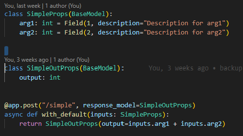
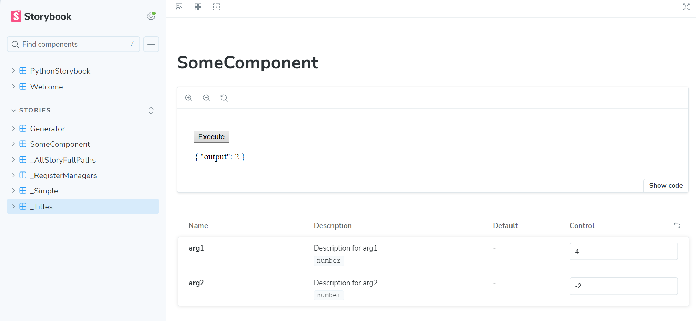

## Greeting

Hi, I am Siung Kim.\

If you are python developers, you will happen to use my packages with the namespace `crimson` from time to time in the near future. If you can't believe it, try the [IntelliType](https://github.com/crimson206/intelli-type) module first. Now, I can't develop other modules without it.

I have bachelor and master degrees in Physics. Since I experienced ChatGPT, I am dedicating my all time and background to AI. While studying and developing AI applications, I got sick and tired of the instability and dirty codes of many AI related modules. While AI field is growing so fast, it will take time to stabilize it.

I also decided to focus on the stabilization first. If you have things in common with me, please follow me up.

**Interests**
- Establishing New Development Style
- Clean Code
- LLM based Multi-modal Applications
- AI-based Automation

## Collaboration

**Development Environment**
- I am establishing a new development style called 'Micro-wise Development'. If you want to apply this into your company, please contact me.

**Automation & Clean Code**
- I am a very lazy person. I really hate working on repeated tasks. That is why I am investing 60~70 hours a week to automate them. I really hated to write docstrings. They doesn't have the functionalities, and many contents are duplicated, and ... and... I now really like it. When I write docstring, I hardly write repeated things. I accomplished it from both my automation and Clean Code skills. If you want to apply the same level of standard in your company or institute, please contact me.

**AI Applications**
- I basically started everything because of AI. While they don't look like to be related to AIs, I am always thinking of the integration with AIs. If your company does AI, and want to listen to my perspectives as a DevOp & AI expert, please contact me.

## Programming Languages

- Python: Advanced
    I am currently publish many small pypi modules.
    I have projects, such as, 'Micro-wise Development' and 'Python Storybook'

- TypeScript: Intermediate
    I started TypeScript to develop my own AI applications.
    I am interested in Python-Typescript integration based on Storybook, and
    it is the 'Python Storybook' project.

## Projects

- Micro-wise Development:
    - Initiation:
        This project was inspired from Storybook, or component-driven development.
        In Storybook, each component is separately developed, tested, and you can generate dedicated examples for each component.
        I decided to import the concept to python.

    - Repository:
        Please check the [repository](https://github.com/crimson206/microwise-development) for the general information.

- Python-Storybook:
    The purpose of this project is to generate Storybook(typescript) components automatically from python functions. See the prototype below.

    
    

    Although I didn't bring an example with a function, all belows must be automated.

    - {FuncName}InputProps
    - {FuncName}OutProps
    - All the elements in Props, such as, annotation, description.
    - endpoint
    - typescript function wrapper
    - Storybook Component

    **Delaying Factors**

    - Reliability
        The example is also generated in that manner.
        For the agreed types(int, str, List...), all the technical stacks were prepared. However, I will not buy the potential dependency hell. It means that, the priority of it is behind that of Micro-wise Development. A stable and extendable Python-Storybook will be published soon or later with Clean Code. 

    - Publication Generalization
        To generate an interactive document of python module, app publication is the most stable currently. There are some attempts to use python in browser directly(Pyodide, python in StackBlitz, and more...), but they are unstable, and very limited. Therefore, we will make the deployed endpoints using GCP or AWS. It means, you allow users to use the cloud computational resource you need to pay for. We need a generalized controller for the Rate Limits.

    **Further Usage**

    While the initial goal is to realize the automated interactive docs of python modules, the automatically imported functions in typescript, of course, can be used for further purposes.
    
    - Autodocs of Storybook:\
        Check my [IntelliType](https://github.com/crimson206/intelli-type) and [AutoPydantic](https://github.com/crimson206/auto-pydantic) modules. I am a python typehint expert. To get the specified interfaces for each args, such as, radio, select box, so on, we need to add one more denotation. I, as the developer, have to touch the typescript scripts to realize it, and you, as users, will set the denotation in python script. For this, we can generate special types like `arg1 : Range(int, (1, 10]))`.

    - Publish as Components:\
        I initially started this project to component-rise the AI applications in python. You develop a complete RAG or ChatBot application solely in python scripts, and push it to the Python-Storybook, and you have your AI web-application without additional front-end efforts.

    - Extensions:\
        Storybook extends its functionalities using add-ons. If you start to use Python-Storybook, you will definitely want to learn Typescript as well. We can use different Storybook add-ons for the extendibility, but we can also develop our on add-ons in typescript-side or in python-side.