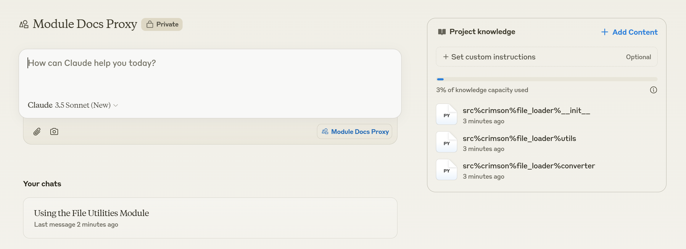
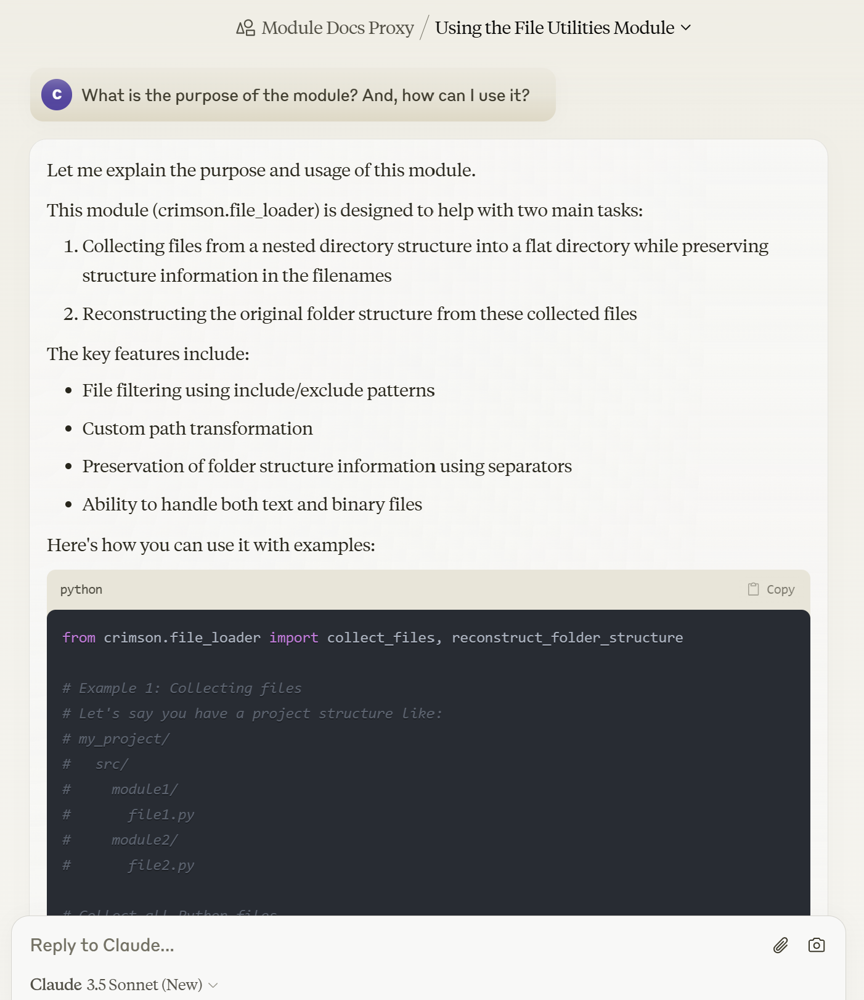

[한국어](./readme_kr.md)

## Table of Contents
- [Table of Contents](#table-of-contents)
- [About Me](#about-me)
  - [Personal Goal as a Professional Developer](#personal-goal-as-a-professional-developer)
- [Micro-wise-Development](#micro-wise-development)
- [AutoDocs](#autodocs)
- [Break Conventions](#break-conventions)
- [Python-Typescript Integration](#python-typescript-integration)

## About Me

### Personal Goal as a Professional Developer

I am a developer striving for advanced automation in programming, using a new methodology called MWD ([Micro-wise-Development](https://github.com/crimson206/micro-wise-development)). This automation aims to integrate deterministic approaches based on conventional programming with dynamic approaches powered by AI.

## Micro-wise-Development

Micro-wise-Development (MWD) is an innovative methodology where every software feature is modularized into its smallest functional units, each independently managed in its own repository. From small utilities for personal use to sophisticated and high-dimensional features for many users, all code is broken down into micro-sized components for development.

I apply this methodology to over 100 repositories I maintain and dozens of [PyPI packages](https://pypi.org/search/?q=crimson206). MWD encourages individual developers to actively publish small modules, and all of my packages are managed under the namespace "crimson" to prevent conflicts and maintain consistent branding within the community.

## AutoDocs

Currently, documentation is omitted for most of my repositories based on strategic reasons:

- Not all modules are intended for official release
- Documentation is supplementary to the core implementation
- Traditional documentation limits flexibility for module modifications and extensions
- The goal is to achieve complete automation of documentation, avoiding temporary manual efforts

Instead, newer Python modules include an `example` folder, which serves both as documentation and as a test suite through [nbval](https://github.com/computationalmodelling/nbval).

Alternatively, the [File-Loader](https://github.com/crimson206/file-loader) module offers a creative approach. All my modules are composed of just a few scripts. The structure generated in the [flatten_module](https://github.com/crimson206/file-loader/tree/main/example/flatten_module) folder by [control.ipynb] can be completely explained by a chatbot like [Sonnet](https://www.anthropic.com/news/claude-3-5-sonnet). These scripts make extensive documentation unnecessary since they are easily understood with chatbot assistance.

    Sonnet Example

    
    

 

My development work is driven by real needs. Although the AutoDocs system is in progress, I don't have an immediate necessity to document all my modules for myself as the primary developer. However, if there is demand, I can adjust the development priorities accordingly, so feel free to reach out if interested.

## Break Conventions

In order to surpass the limits of traditional development practices, I challenge many conventions, leading to experimental efforts aimed at improving the development environment:

- [IntelliType](https://github.com/crimson206/intelli-type): An initial approach to enhance Python's type hinting system. This approach particularly challenges the traditional documentation methods for arguments that are often duplicated across various places without being explicitly bound.

- [Types](https://github.com/crimson206/types): The experimental lab to explore innovative type hinting ideas and annotations in their smallest forms.

- [AutoPydantic](https://github.com/crimson206/auto-pydantic): A tool that automatically converts function specifications into Pydantic models. Initially developed for runtime type checking, it has evolved into a powerful analysis tool.

- [ExecutableTypes](https://github.com/crimson206/executable-types): A specialized type system in enhancing AI model development by enabling dynamic validation of tensor shapes through type hints. It effectively conveys the value of making complex models more comprehensible, without requiring deep analysis.

## Python-Typescript Integration

To enhance the development environment and eventually provide services for end users, I am focusing on developing VSCode and Chrome extensions. Practicing MWD requires frequent environment setups, and the TypeScript ecosystem, compared to Python, involves a more complex set of configurations. To eliminate the inefficiencies of re-implementing functions from Python to TypeScript and to leverage VSCode's extension-driven development convenience in Python, I am pursuing the integration of both languages:

- [ITSNB](https://github.com/crimson206/itsnb-ts): An experimental project to implement an efficient experimentation/development environment in TypeScript similar to Python's .ipynb files. Currently, the TypeScript ecosystem lacks an equivalent research and development environment.

- [PY-TS-Types](https://github.com/crimson206/py-ts-types): A foundational module automating type mapping between Python and TypeScript, serving as a cornerstone for their integration.

- [Storybook](https://storybook.js.org/docs): A framework I am actively using. The [Controls](https://storybook.js.org/docs/essentials/controls) feature, in particular, is expected to play a crucial role in auto-generating interactive documentation pages for Python modules following the Python-TypeScript integration.

- [RunVscode](https://github.com/crimson206/run-vscode-ex): An initial experimental project for programmatically controlling VSCode extensions. Though currently in a legacy state, the [documentation page](https://crimson206.github.io/run-vscode-ex) generated using Storybook provides an early example of creating a documentation page using Storybook.
