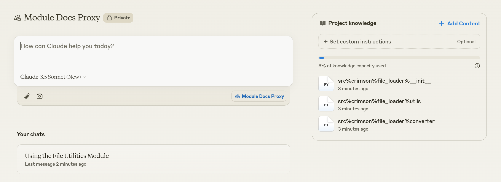

[English](./README.md)

## Table of Contents
- [Table of Contents](#table-of-contents)
- [About Me](#about-me)
  - [Personal Goal as a Professional Developer](#personal-goal-as-a-professional-developer)
- [Micro-wise-Development](#micro-wise-development)
- [AutoDocs](#autodocs)
- [Break Conventions](#break-conventions)
- [Python-Typescript Integration](#python-typescript-integration)

## About Me

### Personal Goal as a Professional Developer

저는 MWD([Micro-wise-Development](https://github.com/crimson206/micro-wise-development))라는 새로운 개발 방법론을 제시하고, 이를 통해 프로그래밍의 고도화된 자동화를 실현하는 개발자입니다. 이 자동화는 프로그래밍 기반의 결정론적(deterministic) 접근과 AI를 활용한 동적(dynamic) 접근을 통합적으로 활용하는 것을 지향합니다.

## Micro-wise-Development

Micro-wise-Development(MWD)는 모든 소프트웨어 기능을 최소 단위로 모듈화하여 개별 Repository에서 독립적으로 관리하는 혁신적인 개발 방법론입니다. 개인이 사용하는 작은 유틸리티부터 다수의 사용자를 대상으로 하는 정교하고 고차원적인 기능까지, 모든 코드를 마이크로 단위로 분리하여 개발합니다.

이러한 방법론의 실제 적용 사례로, 제가 운영하는 100개 이상의 Repository와 수십 개의 [PyPI 패키지](https://pypi.org/search/?q=crimson206)를 들 수 있습니다. MWD는 개발자 개인의 활발한 모듈 배포를 핵심으로 하며, 제가 개발하는 모든 PyPi 패키지들은 'crimson'이라는 단일 네임스페이스 하에서 관리됩니다. 이는 커뮤니티의 네임스페이스 충돌을 방지하는 동시에, 일관된 브랜딩 효과를 창출합니다.

## AutoDocs

현재 제 대부분의 Repository들은 문서화가 생략되어 있습니다. 이는 다음과 같은 전략적 판단에 기반합니다:

- 모든 모듈이 공식 배포를 목적으로 하지는 않습니다
- 문서화는 핵심 구현과는 별개의 부가적인 작업입니다
- 기존 문서화 방식은 모듈의 유연한 수정과 확장을 제한합니다
- 문서화의 완전 자동화를 목표로 하고 있어, 임시적인 수동 문서화에 리소스를 투자하지 않습니다

대신, 최근 개발된 Python 모듈들은 example 폴더를 포함하고 있으며, 이는 문서화 기능과 [nbval](https://github.com/computationalmodelling/nbval)을 통한 테스트 기능을 동시에 수행합니다.

대안으로는 [File-Loader](https://github.com/crimson206/file-loader) 모듈이 제시하는 창의적인 방법을 사용하는 것입니다. 제 모든 모듈을은 오직 몇 장의 script들로 구성 돼 있습니다. [control.ipynb] notebook에 의해 생성된 [flatten_module](https://github.com/crimson206/file-loader/tree/main/example/flatten_module) 폴더를 참고해 주세요. 단 몇장의 script로 완성된 구조를 가진 모듈들은, 그 script들을 [Sonnet](https://www.anthropic.com/news/claude-3-5-sonnet)과 같은 Chatbot에게 제공됐을 때 완벽하게 설명되며, 이는 문서화의 무조건적인 필요성을 대체합니다.

    Sonnet Example

    
    

 

제 모든 개발은 실제 필요성에 기반을 두고 있습니다. AutoDocs 시스템은 현재 개발 진행 중이지만, 모듈의 주 개발자인 저를 위해선 당장 제 모듈들을 문서화 할 필요성은 현저히 떨어집니다. 다만, 이에 대한 외부 수요가 있다면 개발 우선순위를 조정할 수 있으니 관심 있으신 분들은 문의 주시기 바랍니다.

## Break Conventions

기존 개발 방식의 한계를 넘어서기 위해, 저는 많은 일반적인 Convention들에 도전하고 있습니다. 이는 개발환경 자체를 개선하기 위한 실험적 시도들로 이어지고 있습니다:

- [IntelliType](https://github.com/crimson206/intelli-type): An initial approach to enhance Python's type hinting system. This approach particularly challenges the traditional documentation methods for arguments that are often duplicated across various places without being explicitly bound.

- [Types](https://github.com/crimson206/types): The experiment laboratory to adopt the innovative type hinting ideas and annotation in the smallest forms.

- [AutoPydantic](https://github.com/crimson206/auto-pydantic): A tool that automatically converts function specifications into Pydantic models. While initially developed for runtime type checking, it has evolved into a powerful analysis tool.

- [ExecutableTypes](https://github.com/crimson206/executable-types): A specialized type system in enhancing AI model development by enabling dynamic validation of tensor shapes through type hints. It effectively conveys the value of making complex models more comprehensible, without requiring deep analysis.

## Python-Typescript Integration

저는 개발환경 개선과 최종적으로는 일반 사용자를 위한 서비스 개발을 목표로 하고 있어, VSCode와 Chrome Extension 개발에 주목하고 있습니다. MWD의 실천은 빈번한 개발환경 셋업을 수반하는데, 특히 TypeScript 생태계는 Python에 비해 더 복잡하고 다양한 환경 설정을 요구합니다. 이에 Python에서 구현된 기능을 TypeScript에서 중복 구현해야 하는 비효율을 해소하고자, 또, VSCode가 Extension들이 주는 개발환경에 대한 편의를, 가장 쓰기 편한 Python언어로 불러오기 위해, 두 언어의 통합을 진행하고 있습니다:

- [ITSNB](https://github.com/crimson206/itsnb-ts): An experimental project to implement an efficient experimentation/development environment in TypeScript similar to Python's .ipynb files. Currently, the TypeScript ecosystem lacks an equivalent research and development environment.

- [PY-TS-Types](https://github.com/crimson206/py-ts-types): A foundational module automating type mapping between Python and TypeScript, serving as a cornerstone for their integration.

- [Storybook](https://storybook.js.org/docs): A framework I am actively using. The [Controls](https://storybook.js.org/docs/essentials/controls) feature, in particular, is expected to play a crucial role in auto-generating interactive documentation pages for Python modules following the Python-TypeScript integration.

- [RunVscode](https://github.com/crimson206/run-vscode-ex): An initial experimental project for programmatically controlling VSCode extensions. Though currently in a legacy state, the [documentation page](https://crimson206.github.io/run-vscode-ex) generated using Storybook provides an early example of creating AutoDocs using Storybook.
